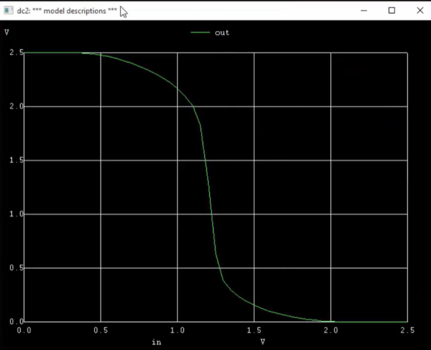
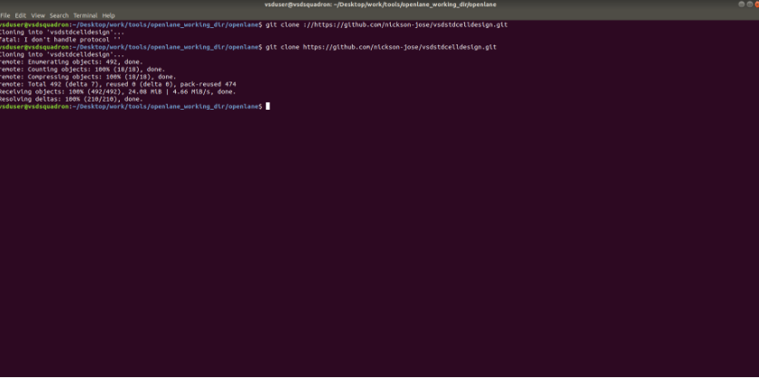
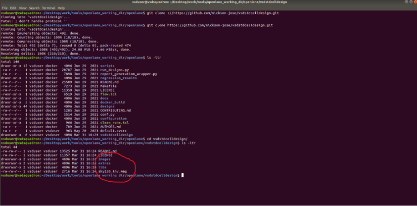
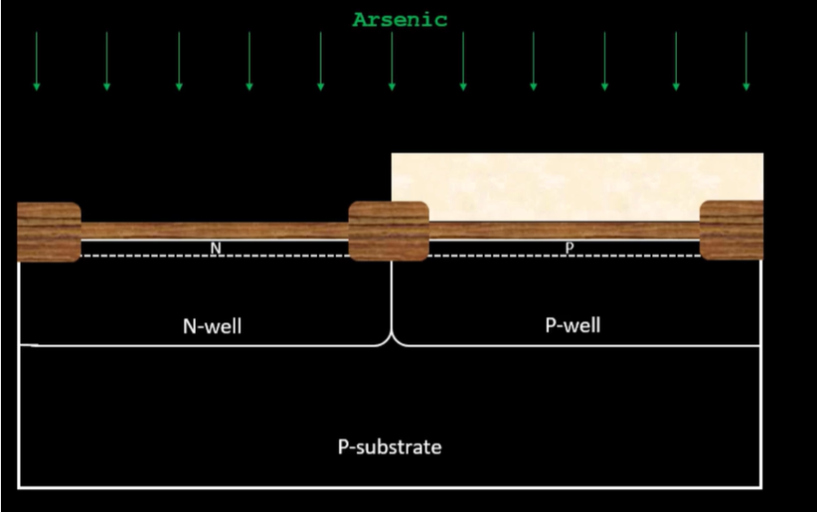
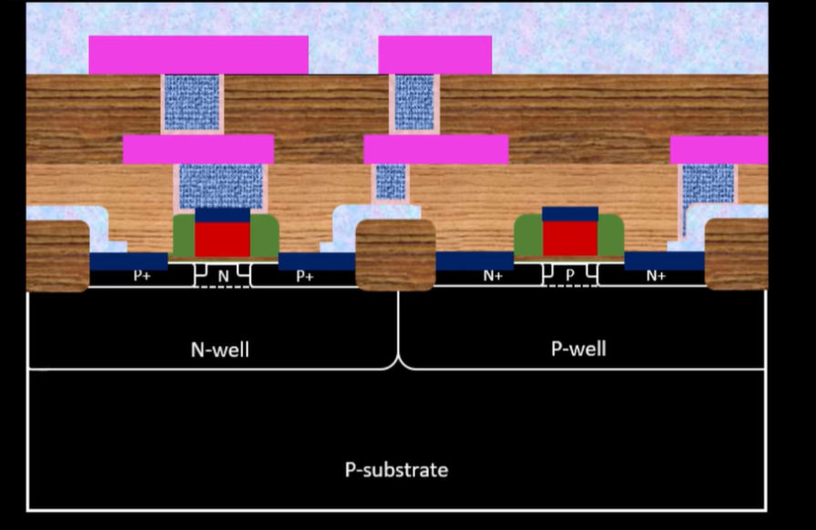
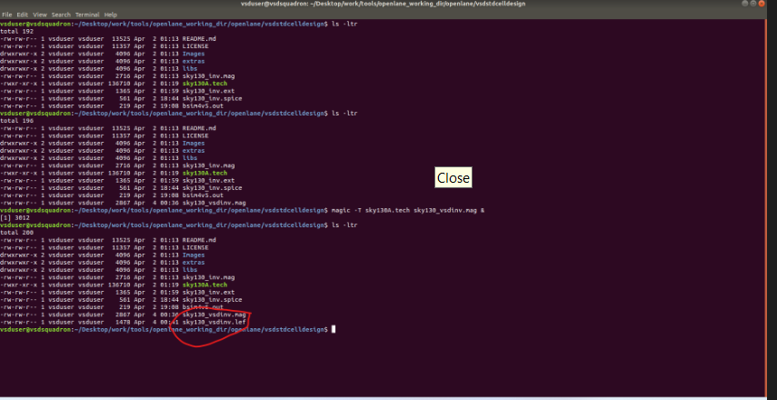
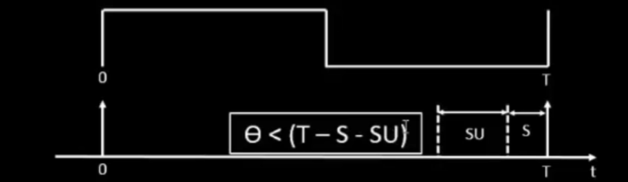
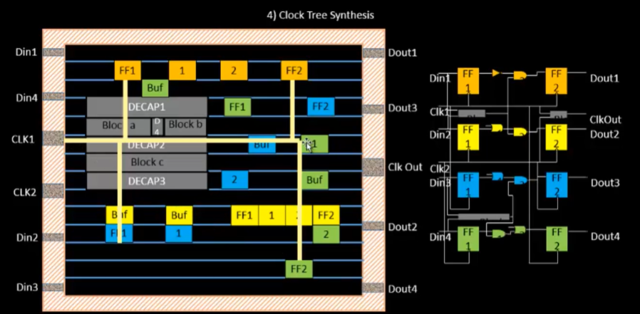

# DIGITAL-VLSI-SOC-DESIGN-AND-PLANNING

# <h1 id="header-1">Day 1 -Inception of open-source EDA, OpenLANE and sky130 PDK</h1>	 
## <h1 id="header-1_1">How to talk to computers?</h1>
### <h1 id="header-1_1_1">Introduction to QFN-48 Package, chip, pads, core, die and IPs</h1>

**Arduino Board**:- An Arduino board serves as a microcontroller, distinguished by its integrated microprocessor chip (highlighted in the encircled region) that interfaces with the surrounding circuitry. The development of this chip, from high-level abstraction to the final fabrication stage, adheres to the RTL to GDSII design methodology. Arduino, as a platform, comprises a physical, programmable circuit board and a software component, the Integrated Development Environment (IDE), enabling users to write and upload code to the board from a computer.


#### Chip components 
i **Pads:** Through which we can send the signal inside the chip.

ii **Core:** Place where all the logic gates are fixed.

iii **Die:** Present at the corner. it is the size of the entire chip.

**Eg. RISC-V SoC**:- Key components like SRAM, SoC, ADC, DAC, and SPI are considered foundry intellectual property (IP). The fabrication of all integrated circuits depends on foundries, which employ techniques such as deposition and lithography for chip manufacturing.


### <h1 id="header-1_1_2">Introduction to RISC-V</h1>
**RISC-V** refers to the fifth generation of Reduced Instruction Set Computer (RISC) architectures developed at the University of California, Berkeley. This open-standard instruction set architecture (ISA) is built upon well-established RISC principles. A key differentiator for RISC-V is its availability under open-source licenses, meaning there are no fees associated with its use, unlike most other ISA designs. Consequently, several companies are now providing or have announced RISC-V hardware, and open-source operating systems with RISC-V support are readily available. Furthermore, various popular software toolchains also support this instruction set.

The RISC-V instruction set is engineered for broad applicability. Its foundational instruction set features a consistent 32-bit length with natural alignment. The ISA also accommodates variable-length extensions, allowing instructions to comprise any number of 16-bit segments. The specification for the instruction set outlines both 32-bit and 64-bit address space variations. While a 128-bit flat address space variant is described as an extrapolation, its specification remains "not frozen." This intentional decision reflects the limited practical experience with such expansive memory systems to date.
Chip is connected to the package with the help of bond wires.


### RISC V SoC CHIP


The central component is a **RISC SoC (System-on-Chip) chip**. This chip integrates several key functional blocks, which the image labels as "Macros" and "Foundry IPs," indicating pre-designed and validated components.

Prominently displayed within the SoC are a **GPIO (General Purpose Input/Output) bank** and an **SRAM (Static Random-Access Memory)** block. The GPIO bank suggests the chip's ability to interface with external devices through various digital pins, as seen with the numerous "gpio" labels surrounding the chip. The SRAM block provides fast, volatile memory for data storage during operation.

Additionally, the chip incorporates other "Foundry IPs" essential for its functionality. These likely include Analog-to-Digital Converters (ADCs) and Digital-to-Analog Converters (DACs) for handling analog signals, and an SPI (Serial Peripheral Interface) module, indicated by the "SPI" label and associated pins, for serial communication with peripherals. The presence of these IPs alongside the RISC core signifies a comprehensive, integrated solution designed for a range of embedded applications.

### <h1 id="header-1_1_2">From Software Applications to Hardware</h1>


This section explores the execution of applications on a computing system, detailing the flow from application software through system software to the hardware chip. Applications first interact with the system software, which is responsible for translating the entire program into binary code. Within the system software, several layers facilitate this process: the Operating System (OS), Compiler, and Assembler. 

The OS manages fundamental tasks such as input/output (I/O) operations, memory allocation, and low-level system functions. The Compiler receives high-level programming languages (like C, C++, or Java) from the OS and translates them into hardware-specific instructions. Subsequently, the Assembler converts these instructions into binary numbers. 

This binary data is then sent to the hardware, which executes the received functions and generates the corresponding output. Essentially, instructions serve as an abstract interface between high-level programming languages and the underlying hardware.

### Stopwatch App: A Journey from C Code to Chip Execution

This diagram illustrates the practical application of the software-hardware interaction pipeline, using a simple "Stop Watch app" as an example.
- **Application Layer (Eg. Stop Watch app):** At the top, we see the user-facing **Stop Watch app** displaying "00:00:03.70", which is the desired output of the application.
- **Compiler Input (a 'C' function for stopwatch):** The process begins with the human-readable source code. Here, a "C" language function for the stopwatch is shown. This code includes standard libraries (`stdio.h`, `time.h`) and defines a `main` function that implements the stopwatch logic, including updating time, printing to the screen, and handling delays (`sleep(1)`).
- **System Software:** This layer, encompassing the **Operating System (OS)** (like Windows 7 or Linux depicted), acts as the primary orchestrator. As before, the OS handles fundamental tasks such as managing I/O operations (like displaying the time on the screen), allocating memory for the program, and overseeing low-level system functions essential for the stopwatch to run.
- **Compiler:** The "C" source code is then fed into the **Compiler**. The compiler translates this high-level code into lower-level instructions. The output, often an executable file (like `*.exe`), contains these machine-understandable instructions (`Instr1`, `Instr2`, etc.), which are specific to the target hardware architecture (in this case, implied to be RISC-V from previous context).
- **Compiler and Assembler Output (A RISC-V assembly language program):** The instructions from the compiler are further processed by an assembler (or the compiler's backend directly generates assembly). The diagram explicitly shows a representation of the RISC-V assembly language. This is a human-readable form of machine code, where instructions like `addi`, `sd`, `lui`, `jalr` are seen alongside memory addresses (e.g., `0: 7136`, `4: sd`). This assembly code directly corresponds to the binary instructions the hardware will execute.
- **Hardware (Chip Layout):** Finally, the assembly instructions are converted into pure binary code and sent to the **Hardware**, specifically the **Chip Layout**. This intricate physical design of the integrated circuit executes the binary instructions. The diagram shows the physical pathways and components on the chip. The hardware processes the binary input (implied by the assembly) and produces the desired output, which, in this example, would be the updated time displayed by the stopwatch app on the screen.

This example clearly demonstrates how a high-level application concept like a stopwatch is progressively transformed through various software layers into low-level instructions that the physical hardware can understand and execute.

 ## <h1 id="header-1_2">Soc design and OpenLANE</h1>
### <h1 id="header-1_2_1">Introduction to all components of open-source digital asic design</h1>


To design Digital ASIC, few tools or things which are required from the day one. These are

**RTL Design
EDA tools
PDK data**
**what is RTL design?**
In digital circuit design, register-transfer level (RTL) is a design abstraction which models a synchronous digital circuit in terms of the flow of digital signals (data) between hardware registers, and the logical operations performed on those signals.for this designs many open sorces are available. like, librecores.org, opencores.org, github.com, etc...

**What is EDA tools?**
The term Electronic Design Automation (EDA) refers to the tools that are used to design and verify integrated circuits (ICs), printed circuit boards (PCBs), and electronic systems, in general. many open sorces tools are available like Qflow, OpenROAD, OpenLANE, etc...

**What is PDK Data?**
PDK is process design kit. It is interface between FAB and design. This data is collections of files like,

process design rules: DRC, LVS, REX
Digital standerd cell libreries
i/o librerirs
etc.....
which are used to model a fabrication process for the EDA tools used to design an ICs. for example, in 2020, google release the open source PDK for FOSS 130nm production with the skywater technology. But right now it is at cutting age of the 5 nm also. But in many applications, the advance node is not required, and the cost of advanced node is also high as compared to 130nm processors. This 130nm processors are also fast processor. for example,

intel: P4EE @3.46 GHz(Q4'o4)

sky130_OSU (single cycle RV32i CPU) pipeline version can achieve more than 1 GHz clock.

### <h1 id="header-1_2_2"> Simplified RTL2GDS flow</h1>


**Step 1. Synthesis**:-  In the synthesis, the design RTL is translated to a circuit out from the SCL. The resultant circuit is describes in HDL and usualy refered to the gate level netlist. the gate level netlist is functionaly equivelent to the RTL. "standard Cells" have regular layouts like Electrical. HDL,SPICE


**Step 2. Floor/Power Planning**:-The main objective here is that to plan silicon area and distribute the power to the whole circuit. In the chip floor planning, the partition chip die between different system building blocks and place the i/o pads. In micro floor planning, we define the dimensions, pin locations, rows.
In power planning, the power network is connstructed. tipically, the chip is power by multiple VDD and GND. so, total components are connected to power supply horizontaly and vertically by metal streps. here parallel structures are used to reduce the resistance. To address the electromagnetization problem, power distribution network uses upper metal leyers, which are thicker than lower metal layers. Hence have less resistance.


**Step 3. Placement**:- In this process, we place the gate level netlist on the floor planning rows, alligned with the sites. cells should be placed very closed to eachother to reduce the interconnnect delay. Usually placement is done in 2 steps:

**Global placement**:- It is very first stage of the placement where cells are placed inside the core area for the first time looking at the timing and congestion. Global Placement aims at generating a rough placement solution that may violate some placement constraints while maintaining a global view of the whole Netlist.

**Detailed placement**:- In detailed placements, we determined the exact route and layers for each netlist. the objective of detailed placement is valid routing, minimize area and meet timing constrains. Additional objective is minimum via and less power.


**Step 4. Clock Tree Synthesis**:- Clock distribution is a crucial step preceding signal routing. In clock synthesis, the clock signal is propagated to all sequential components like flip-flops, registers, Analog-to-Digital Converters (ADCs), and Digital-to-Analog Converters (DACs). The resulting clock network typically forms a tree-like structure, where the clock source serves as the root and the clocked elements are the terminal leaves. The synthesis process demands careful execution to ensure minimal clock skew and a robust network configuration. Specialized low-skew global routing resources are employed for clock signals to mitigate skew. Microsemi, for instance, offers various global routing capabilities that notably reduce skew. Standard clock tree topologies include H-tree and X-tree designs.


**Step 5. Routing**:- After routing the clock, the signal routing comes. Making physical connections between signal pins using metal layers are called Routing. Routing is the stage after CTS and optimization where exact paths for the interconnection of standard cells and macros and I/O pins are determined. There are two types of nets in VLSI systems that need special attention in routing:

Clock nets
Power/Ground nets
The sky130 PDK defines the 6 routing leyers. the lowest leyer is called local interconnect layer (titanium nitride layer). Other five layers are alluminium layersIn the proccess of routing, metal trackes forms a routing grids and these grids are huge. so, devide and conquer approach is use for routing. The two types of routing is used:

**Global routing:** Generates the routing guides

**Detailed Routing:** Uses the routing guides to implement the actual wiring.


**Step 6. Sign Off**:- Once the routing is done, we can construct the final layout. This final layout will goes under the verification. Two types of verifications are there:

Physical verification: Here design rule checking will done and it will check the final layout and owners layout
Timing Verification: Here Static Timing Analysis will done.


### <h1 id="header-1_2_3">Introduction to OpenLANE and Strive chipsets</h1>

OPENLANE provides an automated RTL-to-GDSII flow, utilizing multiple tools such as OpenROAD, Yosys, Magic, Netgen, Fault, CVC SPEF-Extractor, CU-GR, Klayout, and various scripts for design exploration and optimization. This flow began as an open-source project for authentic open-source tape-out endeavors. striVe signifies a line of entirely open SoCs: featuring an Open PDK, Open EDA, and Open RTL.


striVe SoC Family


The main goal of OPENLANE is to produce a clean GDSII with no human intervation (no-human-in-the-loop). here the meaning of clean is that:

No LVS violations

No DRC Violations

No timing Violations

OPENLANE is tuned for skyWter130nm open PDK. it can be used to harden Macros and chips.there is two mode of operation
Autonomus : it is the push botton flow. with the push botton , it is a some time base design and due to this push botton, we get final GDSII

interactive : here we can run comamds and steps one by one.

It has large number of design examples(43 designs with their best configurations).


### <h1 id="header-1_2_4">Introduction to OpenLANE detailed ASIC design flow</h1>


The above block diagram shows the OpenLANE detailed ASIC design flow.

**Synthesis Exploration**


This graph illustrates **synthesis exploration** by plotting **design area (μm2) against circuit delay (ps)** for different implementation strategies (S1-S8). Each point represents a unique design trade-off. The goal is to find designs with **lower area and lower delay**, effectively identifying optimal solutions on the performance-area frontier.

**Design Exploration and OpenLANE regresssion testing**


The design exploration utility is also used for regression testing(CI). we run OpenLANE on ~ 70 designs and compare the results to the best known ones.

**DFT(Design for Test)**
it perform scan inserption, automatic test pattern generation, Test patterns compaction, Fault coverage, Fault simulation.After that physical implementation is done by OpenROAD app. physical implementation involves the several steps:


Floor/Power Planning

End Decoupling Capacitors and Tap cells insertion

Placements: Global and Detailed

Post Placement Optimization

Clock Tree synthesis (CTS)

Routing: Global and Detailed

Netlist changes occur frequently, notably during Clock Tree Synthesis (CTS) and Post-Placement Optimization, requiring verification. Formal verification, often utilizing tools like LCE (Yosys), is crucial to ensure functional equivalence after netlist modifications. Addressing antenna rule violations is also key: during fabrication, metal wire segments can behave as antennas, collecting charges. This charge accumulation can lead to damage to transistor gates, making it vital to prevent such occurrences in the manufacturing flow.


Mitigating this issue involves restricting wire lengths, a task commonly handled by the router. If the router cannot resolve the problem, two alternatives are available: either bridging, which connects segments via a higher metallization layer, or adding antenna diode cells. These specialized diodes, sourced from the SCL, effectively drain excess charges, thereby protecting transistor gates from potential damage during the fabrication process.


OpenLANE adopts a proactive strategy for antenna rule management. Initially, placeholder antenna diodes are inserted beside every cell input following placement. Subsequently, an antenna checker analyzes the routed layout. When this checker flag a violation at a cell input pin, the temporary diode cell is then swapped with a functional one.


**Static Timing analysis(STA)**
It involves the interconnect RC Extraction(DEF2SPEF) from the routed layout, followed by STA on OpenSTA(OpenROAD) tool. resulting report will shows the timing violations if any violations is there.

**Physical Verification (DRC and LVS)**
Magic is used for design Rules checking and SPICE Extraction from Layout. Magic and Netgen are used for LVS.


## <h1 id="header-1_3">Get familiar to open-source EDA tools</h1>
### <h1 id="header-1_3_1">OpenLANE Directory structure in detail</h1>
**Basic Linux Commands**

**cd** : opens the particular folder

**ls** : lists the content of the folder

**pwd** : shows the present working directory

**mkdir** : to make a new directory

**command --help** : shows the complete use that command

**clear** : clears the terminal screen

The above Linux commands are performed in terminal and the same as been shown in the figure below.


Here we are working in Sky130_fd_sc_hd PDK varient. where, "sky130" is process name or node name."fd" is a foundary name (skyWater foundary)."sc" means standerd cell librery files and the last one "hd" stands for high density(basically one type of varient).

Sky130_fd_sc_hd varient contains many technology files like verilog, spice, techlef, meglef,mag,gds,cdl,lib,lef,etc. (techlef file contains the layer information).


### <h1 id="header-1_3_2">Design Preparation Step</h1>
Accessing OpenLANE requires using the `flow.tcl` script to direct the automated design sequence. By incorporating the "interactive" switch, users can execute the process incrementally, step by step. Conversely, running the script without this switch will carry out the entire RTL to GDSII flow in one go. Once OpenLANE is successfully launched, a visible change in the command prompt will signify its operational status.


Now we have to input all the packages which required to run the flow.


Now, here we are ready to execute the command.

Within OpenLANE's design directory, numerous pre-built designs, numbering around 30 to 40, are accessible. Any of these can be opened; for instance, here we're examining the `picorv32a.v` design. This particular design folder contains various associated files, such as `src` and `config.tcl`. The `config.tcl` file is comprehensive, detailing every aspect of the design, including critical information like enrollment particulars, specified clock period, and clock port details, among others.


Here we can see that the time period is set to the 5.00 nsec. but is we see in the openlane sky130_fd_sc_hd folder, the period is set about 24 nsec. so it is not override to the main file. If it override then give first priority to the main folder.

Now, in openlane, we are going to run the synthesis, but before synthesis, we have to prepare design setup stage. for that command is ``` prep -design picorv32a```


so, here it is shown that preparation is completed.


### <h1 id="header-1_3_3">Review files after design prep and run synthesis</h1>

After completing the preparation, in the picorv32a file, the run terictory is created. Inside the folder, Today's date is created. so in this terictory some folders are available which is required for openlane.

In the tmp file, merged.lef file is available which was created in preparation time. if we open this merged.lef file, we get all the wire or layer level and cell level information.


While, in the result folder is empty because till we have not run anything and in the report folder all the folders are there about synthesis, placement, floorplanning,cts,routing,magic,lvs.

now here also one config.tcl file is available similar like design folder. But this config.tcl file contains all default parameter taken by the run.

when we make some change in the origional configuration and then we run, for example if we make a change in core utilization in the floorplanning and then we run the floorplanning, at this time in the congig.tcl file, the core utility will change and by cross checking it we can check that the modification is reflected in the exicution or not.

Now coming to the openlane, we are going to run the synthesis. for that command is run synthesis which is shown below. It will take some 4-5 mnts to run the synthesis and finally synthesis will complited.

```bash
run_synthesis
```
The image below shows our synthesis runs successfully. 


### <h1 id="header-1_3_5">Steps to characterize synthesis results</h1>

From the data of synthesis, total number of counter D_flip-flops is 1613. and the number of cells is 14876.


So, the flop ratio = (number of flip flops)/(number of total cell).

So, the flop ratio is 10.84%.

Before run, we saw that the result folder is empty. but now, after running the synthesis, we can see that all the mapping have been done by ABC.


And in the report, we can see when the actual synthesis has done. and the actual statistics synthesis report is showing below, which is same as what we have seen before.


The below figure shows the timing report of the pre-layout synthesis.


# <h2 id="header-2">Day 2 - Good floor planning considerations</h2>	 
## <h2 id="header-2_1">Chip Floor planning consideration</h2>
### <h2 id="header-2_1_1">Utilization factor and aspect ratio</h2>

Let's determine the width and height of the Core and Die, a crucial initial step in the physical design flow. We'll start with a netlist comprising two flip-flops interconnected by basic combinational logic. A netlist, fundamentally, defines the interconnections within an electronic circuit. Our focus here hinges on the physical dimensions of the constituent logic gates (AND and OR) and the specific flip-flops employed. Our goal is to translate these symbolic representations into tangible physical dimensions, specifically for the Core and Die areas, while excluding the dimensions attributable to routing wires. 

Let's standard cell have dimensions of 1unit*1unit

So, area= 1 Sq. units

Asuume same area for the flipflop as well = 1 Sq. units

with help of these dimensions and netlist let's calculate the area occupied by the netlist on a silicon wafer.


Prior to delving into detailed routing, we effectively condense all the flip-flops and logic gates onto a unified "plate" or base. By consolidating these components and abstracting away the interconnecting wires for this initial calculation, we can determine a preliminary footprint. In this simplified view, if the width and length of this combined unit are both 2 square units, then the total occupied area amounts to 4 square units. This gives us a rough, minimum area estimate for the given netlist, setting the stage for subsequent physical design steps.


What is 'Core' and 'Die' section of a chip?

We have a silicon wafer on which all the logics are implemented. In this one section is referred as 'Die' and inside the Die we have the Core. 

A **Die** which consists of core, is small semiconductor material  specimen on which the fundamental circuit is fabricated.

A '**Core** is the section of the chip where the fundamental logic of the design is placed.


Now, envision placing this aggregated logic, representing our netlist, within the core of the chip. If this netlist is designed to fully occupy the entire core area, it signifies 100% core utilization. This concept allows us to calculate the "utilization factor," a critical metric in physical design. The utilization factor is typically defined as:

Utilization Factor = Area occupied by netlist / Total area of the core
   
Let us now put the dimensions we have,

Utilization factor = 4*1sq.unit / 2unit *2unit = 4sq unit /  4sq unit

So, utilization factor = 1 (It means core has utilized all the area and no span left)

Aspect Ratio = Height /  width =  2 unit /  2unit =  1

Whenever Aspect Ratio is 1 it signifies that chip is square shaped. When it is not 1 it means the chip is in rectangular shape.


For example, Lets take another dimensions of the width= 4unit and height = 2unit. So from the above formula of utilization factor we it equal to 0.5 which means the chip has not covered the whole area of the core and aspect ratio is also 0.5  which means the chip is rectangular in shape.

The leftover area can be used to placed some additional cells like buffers or something else.


### <h2 id="header-2_1_2">Utilization factor and aspect ratio</h2>

Lets take another example for a square chip wth dimensions 4*4 sq units. We will get utilization factor= 0.25 it means out of the whole chip area only 25% area is utilized by the netlistand 75% is available for additional cells which can be use for routing in which we will have layering. Aspect ratio we get = 1 it means chip is square in shape.


**Define locations of Preplaced Cells**:-  Lets take a combinational logic which does some amount of function and assume its a huge circuit having some N Logic gates so let's devide it into some small numbers of gates. We will cut the whole circuit into two parts, and separate both of them into two blocks and both block will be implemented seperately.


In both the blocks lets extend the input output pins and now we will black box the boxes and detached them. After black boxing, the upper portion is invisible from the top or invisible to the one , who is looking into the main netlist. now will seperate them out as two different IP's or modules.


A significant advantage of this modular approach is the ability to reuse these pre-designed components multiple times after a single implementation. This principle extends beyond basic logic gates and flip-flops to other Intellectual Property (IP) blocks. For instance, specialized IP cores like Memory units, Clock-gating cells, Comparators, and Multiplexers are all integral parts of a larger, top-level netlist. Each of these IPs receives specific input signals, performs its designated function, and delivers outputs, yet their complex internal functionality is designed and verified only once, making them readily deployable in diverse designs. 

The arrangement of these IP's in a chip is refer as **floor planning**.

These IP's have user-defined locations, and hence are placed in chip before automated placement and routing are called **"pre-placed cells"**. 

These cells are placed in such a way that, the placement and routing tool do not touch the location of the cell.


The figure above illustrates the placement of pre-placed cells within a chip's core, demonstrating how larger, fixed-location blocks (Block a, Block b, and Block c) are integrated into the overall die and core structure.


### <h2 id="header-2_1_3">De-coupling capacitors</h2>

#### Enhancing Power Integrity with Decoupling Capacitors
**Why Decoupling is Essential for Pre-Placed Cells?**

Pre-placed cells, such as large IP blocks (memories, processors) or critical clock distribution components, often exhibit high current demands during their switching cycles. These sudden current surges can cause localized voltage drops (IR drop) or ground bounces across the power distribution network. Such fluctuations can negatively impact the performance and reliability of the surrounding circuitry, potentially leading to timing violations or functional failures. By placing decoupling capacitors in close proximity to these pre-placed cells, they can rapidly supply the necessary transient current, thereby stabilizing the local power supply and ensuring consistent voltage levels. This localized energy buffering is vital for maintaining the integrity of the power delivery network and ensuring the robust operation of high-performance integrated circuits.


In real-world circuits, an ideal logic '1' (typically 1V) often experiences a voltage drop, becoming, for example, 0.97V (Vdd'). This directly shrinks both the noise margins: NM low (for logic '0') and NM high (for logic '1'). Such reduced margins create a hazardous scenario where external noise or internal variations can easily cause a signal to be misinterpreted, leading to erroneous operation.


To mitigate this issue, decoupling capacitors (Cd) are strategically placed in parallel with the circuit. Each time the circuit transitions, it draws the necessary current from Cd, while an associated RL (Resistor-Inductor) network is concurrently employed to replenish the charge within Cd. Consequently, the immediate current demands of the circuit are effectively supplied by the decoupling capacitor.


In the chip's layout, this appears as depicted below: decoupling capacitors are strategically positioned among blocks 'a', 'b', and 'c'. Within this entire arrangement, the consistent power supply from these decoupling capacitors is thus ensured. Upon completion of this step, we have effectively addressed the requirements for local power delivery.


### <h2 id="header-2_1_4">Power planning</h2>

Now, let's treat that local circuitry as a black box, a reusable element that can be replicated multiple times. We acknowledge that some logic exists at the boundaries, and the issue of current demand within these local blocks has been addressed by decoupling capacitors. Consider a signal propagating from a driver to a load, specifically a transition from logic '0' to logic '1'. It's crucial to maintain signal integrity across this driver-to-load line so the load receives an accurate representation. Power supply is then applied.

Now, imagine a 16-bit bus that must reliably transmit this same signal from the driver to the load, requiring sufficient power from the supply. However, this bus lacks decoupling capacitors because it's simply not feasible to place them everywhere. Given the power supply is physically distant from this bus, a definite voltage drop will occur along the path.

 


When a specific line on the 16-bit bus signifies a logic '1', it indicates that the associated capacitance is charged to Vdd. Conversely, if it represents a logic '0', that capacitance is discharged to ground. Now, consider this 16-bit bus connected to an inverter. Consequently, all initially charged capacitors will discharge, and those initially discharged will charge, due to the inverter's operation.


The critical issue arises because all capacitors are tied to a single ground connection. During discharge, this common ground experiences a sudden voltage fluctuation, commonly known as a "Ground Bounce." Should the magnitude of this bounce surpass the defined noise margin, the circuit risks entering an undefined state. In this ambiguous condition, the signal could unpredictably settle as either a logic '1' or a '0', rendering the system's behavior entirely unpredictable.


Conversely, all capacitors at '0' volts must charge to 'V' volts via a singular Vdd tap point. This action inevitably causes a voltage drop at that Vdd tap. As long as this voltage reduction remains within the acceptable noise margin, circuit operation is stable. However, if the drop pushes the voltage into an undefined region, the system's behavior becomes unpredictable.


The previously observed phenomenon, characterized by supply voltage degradation, originated from applying power at a singular point. The resolution involves employing multiple power supplies. Consequently, each distinct block will draw current from its nearest power source and similarly discharge current into its closest ground connection. This distributed power delivery configuration is commonly referred to as a **mesh**.


And the power planning is shown below,


### <h2 id="header-2_1_5">Pin placement and logical cell placement blockage</h2>

**Pin Placement**

Let's consider the following design example for implementation. The first circuit here is driven by clk1, while the second circuit is driven by clk2; they have distinct inputs, Din1 and Din2, and corresponding outputs, Dout1 and Dout2, respectively. Additionally, we have some pre-placed cells, specifically BlockA, which receives inputs from both Din1 and Din2. Another pre-placed cell, BlockB, takes inputs from clk1 and clk2 and generates a clk output. Therefore, our current setup features four input ports: Din1, Din2, Clk1, Clk2, and three output ports: Dout1, ClkOut, Dout2.


Let's introduce an additional design for implementation. Circuits of this nature are exceptionally valuable for comprehending the intricate timing analysis between different clock domains.


The complete design now appears as shown below, featuring six input ports and five output ports. The intricate connectivity details among these gates are encoded using either VHDL or Verilog hardware description languages, collectively forming what is termed the 'Netlist'.


This diagram illustrates the "Pin Placement" stage in chip design. It shows the core with pre-placed blocks (Block a, Block b, Block c) now surrounded by strategically positioned Decoupling Capacitors (DEC P1, DEC P2, DEC P3). Input and output pins (like Din1, CLK1, Dout1, Clk Out, etc.) are visible along the perimeter of the core. Crucially, the Vss (ground) and Vdd (power) lines form a mesh grid, interconnected by contact points, highlighting the robust power delivery network within the chip.


Let's now integrate this netlist into the core we previously designed, and subsequently, populate the empty region between the core and the die with pin information. The frontend team is responsible for defining the netlist's connectivity, including inputs and outputs, while the backend team handles pin placements. Accordingly, we must position the pre-placed blocks in close proximity to their respective input pins.


One notable observation here is the larger size of the clock-in and clock-out pins compared to standard input and output pins. This is because input clocks continuously supply signals to every element on the chip, and output clocks must deliver signals as rapidly as possible. Consequently, a path with minimal resistance is crucial for both clock inputs and outputs; a larger pin size directly correlates with lower resistance.

Another critical consideration is that this pin placement area becomes restricted for subsequent routing and cell placements. Therefore, it necessitates a logical cell placement blockage, which is visually represented in the image as the shaded areas between the pins.

The floorplan is now finalized, preparing the design for the subsequent Placement and Routing stages.

### <h2 id="header-2_1_6">Steps to run floorplan using OpenLANE</h2>

Before run the floorplanning, we required some switches for the floorplanning. these we can get from the configuration from openlane.


Here we can see that the core utilization ratio is 50% (bydefault) and aspect ratio is 1 (bydefault). similarly other information is also given. But it is not neccessory to take these values. we need to change these value as per the given requirments also.

Here FP_PDN files are set the power distribution network. These switches are set in the floorplane stage bydefault in OpenLANE.


Here, (FP_IO MODE) 1, 0 means pin positioning is random but it is on equal distance.

In the OpenLANE lower priority is given to system default (floorplanning.tcl), the next priority is given to config.tcl and then priority is given to PDK varient.tcl (sky130A_sky130_fd_sc_hd_congig.tcl).

Now we see, with this settings how floorplan run.

### <h2 id="header-2_1_7">Review floorplan files and steps to view floorplan</h2>

In the run folder, we can see the connfig.tcl file. this file contains all the configuration that are taken by the flow. if we open the config.tcl file, then we can see that which are the parameters are accepted in the current flow.


To watch how floorplane looks, we have to go in the results. in the result, one def( design exchange formate) file is available. if we open this file, we can see all information about die area (0 0) (660685 671405), unit distance in micron (1000). it means 1 micron means 1000 databased units. so 660685 and 671405 are databased units. and if we devide this by 1000 then we can get the dimensions of chips in micrometer.


so, the width of chip is 660.685 micrometer and height of the chip is 671.405 micrometer.

To see the actual layout after the flow, we have to open the magic file by adding the command ```magic -T /home/kunalg123/Desktop/work/tools/openlane_working_dir/pdks/sky130A/libs.tech/magic/sky130A.tech lef read ../../tmp/merged.lef def read picorv32a.floorplan.def```

And then after pressing the enter, Magic file will open. here we can see the layout.


### <h2 id="header-2_1_8">Review floorplan layout in Magic</h2>

In the layout we can see that, input output pins are at equal distance.


after selecting (To select object, first click on the object and then press 's' from keyboard. the object will hight lited. to zoom in the object, click on the object and then press 'z' and for zoom out press 'sft+z') one input pin, if we want to check the location or to know at on which layer it is available, we have to open tkcon window and type "what". it will shows all the details about that perticular pin.


so, it show that the pin is in the metal 3.similarly doing for the vertical pins, we find that this pin is at metal 2.


Along with the side rows,the Decap cells are arranged at the border of the side rows.


here we can see that first standerd cells is for buffer 1. similarly other cells are for buffer 2, AND gate etc.


## <h2 id="header-2_2">Library building and Placement</h2>
#### Netlist binding and initial place design 

**Binding a netlist with physical cells:-** This involves translating the abstract logical representation of gates into tangible, geometrically defined components. In the netlist, a NOT gate might be symbolically represented as a triangle, but in reality, it's implemented as a rectangular box with specific physical dimensions (width and height). Similarly, an AND gate and flip-flops, while having distinct logical symbols, are also physically realized as rectangular or square blocks. Therefore, for every component listed in the netlist, a particular shape and precise physical dimensions are assigned. This is crucial because abstract shapes like those for AND or OR gates do not exist in the physical world; all blocks, including these gates, must be defined with real-world width, height, and a proper, typically rectangular, physical form.

 

All wires are now disregarded; the gates, flip-flops, and blocks are now compiled within a designated **Library**.

A library functions as a repository, akin to a collection of books, where all gates and flip-flops are cataloged. This library also stores crucial timing data for each "book," such as gate delays. It can be categorized into two sub-libraries: one dedicated to physical shape and size, and another solely for delay information. Furthermore, the library offers diverse variations of each cell; for instance, the same cell might be available in a larger form. A larger cell typically offers a lower resistance path, resulting in faster operation and reduced delay. Designers can select cells from these options based on specific timing requirements and the available space within the floorplan.


**Placement**: After assigning precise shapes and sizes to each gate, the subsequent step involves positioning these physical representations onto the pre-defined floorplan. We possess a floorplan complete with input and output ports, a specific netlist, and assigned dimensions for every component within that netlist. This effectively provides us with a physical perspective of the logic gates. The immediate next action is to integrate this netlist onto the floorplan, utilizing the connectivity data from the netlist to arrange the physical gate views within the designated layout.

 

Now, with our existing floorplan containing the pre-placed cells from earlier stages, the placement process ensures their undisturbed locations are preserved. Furthermore, it strictly prevents any other cells from being positioned over these pre-existing ones. Our objective is to arrange the physical view of the netlist onto the floorplan such that logical connectivity is meticulously upheld, enabling the circuit to interact efficiently with its input and output ports, thereby maintaining precise timing and minimizing signal delay.


Here, we initially observe the arrangement of the netlist's remaining components on the floorplan. All elements have been positioned to be in close proximity to their respective input and output pins. 

However, the distance between FF1 of Stage 4 and Din4 remains notably larger than other connections. This particular issue can be resolved through further placement optimization.


### <h2 id="header-2_2_2">Optimize Placement using Estimated wire-length and Capacitance</h2>

**Placement Optimization**: In this phase, we address the aforementioned distance issue. Considering the connection from Din2 to FF1, a significant wire length would be required. Before actual routing, we estimate the substantial capacitance and resistance associated with such a long wire. If a signal is sent from Din2, FF1 would struggle to reliably receive that input due to the extended distance. To maintain signal integrity, we can insert intermediate steps called "repeaters." These repeaters, essentially buffers, regenerate the original signal, creating a fresh, identical signal to propagate further. This process repeats until the signal reaches the intended cell, ensuring signal integrity. While repeaters solve the signal integrity problem, they inherently increase area consumption on the floorplan due to their inclusion.


In **Stage 1**, the signal transmission requires no repeaters. However, in **Stage 2**, the considerable distance leads to an extended wire length, causing the signal to fall outside its specified range. Consequently, a repeater becomes necessary to ensure proper signal propagation.


### <h2 id="header-2_2_3">Final placement optimization</h2>

As similar to **Stage 2**, in **Stage 3** also we required the buffer between gate2 and FF2.


**Stage 4** presents unique complexities compared to preceding stages. At this point, it becomes imperative to verify the accuracy of our actions. To achieve this, we must conduct a thorough Timing Analysis, utilizing ideal clock conditions. The data derived from this analysis will then enable us to determine the correctness of the current placement.


### <h2 id="header-2_2_4">Need for libraries and characterization</h2>

Every IC design flow mandates a series of sequential steps. Initially, Logic Synthesis converts a functional description, often coded in RTL, into a valid hardware representation. The outcome of this process is an arrangement of gates that accurately reflects the original RTL-described functionality.

Following Logic Synthesis is Floorplanning, where the synthesized output is imported to determine the Core and Die dimensions. Placement, the subsequent step, involves strategically positioning logic cells onto the chip to optimize initial timing. Next, Clock Tree Synthesis (CTS) ensures that clock signals reach every element simultaneously, while also guaranteeing consistent rise and fall times for each clock signal. Routing then follows a specific flow, dictated by the flip-flop characteristics. 


Finally, Static Timing Analysis (STA) concludes the process by evaluating setup time, hold time, and the circuit's maximum achievable frequency. Throughout all these stages, "GATES or Cells" remain the unifying element.


### <h2 id="header-2_2_5">Congestion aware placement using RePlAce</h2>

Right now we are not constrain about timing, but constrain about the congestion. so, we are making the congrstion is less.

The placement is donne in two stages. Global and detailed. In global placement, legalization is not happened but after detailed placement legalization will be done.

When we run the placement, first Global placement is happens. main objective of glibal placement is to reducing the length of wires.

Now opening the Magic file to see actual view of standerd cells placement.And the actual view in the magic file is given below.


If we zooom into this, we find the buffers, gates, flip flops in this.


## <h2 id="header-2_3">Cell design and characterization flows</h2>
### <h2 id="header-2_3_1">Inputs for cell design flow</h2>

In Cell Design Flow, Gates, flipflops, buffers are named as 'Standard Cells'. These standard cells are being placed in the section called as 'Library'.And in the library many other cells are available which have same functionality but the size is different.


If you lokk into one of the inverter from the library the cell design flowis as follows

The inverter has to represented in form of the shape, drive strength, power charracteristic and so on. Here cell design flow is devided into three parts.

1. Inputs

2. Design steps

3. Outputs

**1) INPUTS**:- Inputs required for cell design is PDKs, DRC and LVS rules SPICE models, library and user defined specs. In DRC& LVS rules tech file is provided which contains design rules and actual values. Rules can be converted in to code. SPICE MODEL tells about threshold voltage equation.


**Inputs DRC and LVS**
This emphasizes that Design Rule Check (DRC) and Layout Versus Schematic (LVS) rules are key inputs from PDKs, providing the geometric and connectivity constraints for valid cell layouts.


**Inputs SPICE Models**
This details how "SPICE model parameters" from PDKs provide the complex mathematical equations and values (like threshold voltage, current in linear/saturation regions) necessary for accurate circuit simulation.


**Inputs Library and user-defined Specs**
There are inputs like height, supply voltage, pin-location, gate length, metal layers etc.


The above figure highlights how "Cell-height" is a crucial input from the Process Design Kits (PDKs) in the cell design flow, influencing the overall vertical dimension of the standard cells and IP blocks.


The above figure illustrates that "Supply voltage" is a fundamental input from PDKs, defining the operational voltage levels critical for the design and performance of the cells within the chip.


The above figure shows "Pin location" as another critical input from the PDKs for cell design, dictating where the input and output connections are precisely positioned on a cell's layout.


The above figure points out that "Drawn gate-length" is a vital parameter derived from PDKs, specifying the physical length of the transistor gates, which directly impacts device performance.


The above figure indicates that "Metal layers" are fundamental inputs from PDKs, defining the number and characteristics of the conductive layers used for interconnects within the cell layout.

### <h2 id="header-2_3_2">Circuit design steps</h2>

The separation between the power rail and the ground rail defines the cell height. Cell width depends upon the timing and drive strength.

**2)Design steps**:- Design involves three steps which are circuit design, layout design, characterization.

**In circuit Design** there are two steps.

First step is to implement the function itself and second step is to model the PMOS and NMOS transistor in such a fashion in order to meet the library.

**3)Outputs**

The typical output what we get from the circuit design is CDL(circuit description language) file, GDSII, LEF, extracted spice netlist(.cir).


### <h2 id="header-2_3_3">Layout design step</h2>

In Layout Design, the initial step involves realizing the desired circuit function using a combination of PMOS and NMOS transistors. Following this, the next crucial phase is to extract the distinct PMOS and NMOS network graphs from the implemented transistor-level design.


After acquiring the network graphs, the subsequent step is to determine the Euler's path. An Euler's path is essentially a traversal within the graph where each edge is visited precisely once.


Next step is to draw stick diagram based on the Euler's path. This stick diagram is derived out of the circuit diagram.


The subsequent step involves transforming this stick diagram into a standard, proper layout, then applying the specific rules previously discussed. Once this particular layout is achieved, all cell specifications, including cell width, cell length, drain current, pin locations, and other relevant attributes, will be precisely defined.


The final step involves extracting the parasitics from the specific layout and characterizing them in terms of timing. Prior to this, the output from the layout design will be in GDSII format. Once the extracted SPICE netlist is obtained, it undergoes characterization. This characterization process provides crucial timing, noise, and power information.

### <h2 id="header-2_3_4">Typical characterization flow</h2>

Drawing upon our available inputs, let's now construct the characterization flow.

The initial step involves ingesting the model. Subsequently, the extracted SPICE netlist is read in. The third step requires defining or recognizing the buffer's behavior. Following this, in the fourth step, the inverter's subcircuits are read. The fifth step necessitates attaching the required power supplies. Next, in the sixth step, the stimulus is applied. The seventh step involves providing the necessary output capacitance. Finally, the eighth step entails issuing the appropriate simulation command; for instance, a `.tran` command for transient simulation or a `.dc` command for DC simulation.

All the steps are shown below in the two images.


Next step is to feed in all this inputs from 1 to 8 in a form of a configuration file to the characterization software **"GUNA"** .

This software will generate power, noise and timing model.


## <h2 id="header-2_4">General timing characterization parameters</h2>
### Timing threshold definitions


As observed in the preceding section, the cascaded inverters, power sources, and applied stimulus introduce a crucial aspect: comprehending the distinct threshold points within a waveform, referred to as "Timing threshold definitions." 

In the accompanying figure, the term 'Slew_low_rise-thr' represents a value near zero, typically around 20%, though it can also be 30%.


Slew_high_rise_thr


Slew_low_fall_thr


Slew_high_fall_thr


Now, considering the input stimulus waveform (the first buffer's input) and the corresponding output waveform from that same buffer, thresholds are also defined for delay, analogous to slew. For this, we must identify specific rise and fall points on the waveforms. These delay thresholds are typically set at approximately 50%.

in_rise_thr


in_fall_thr , its typical value is 50%.


out_rise_thr


out_fall_thr


### <h2 id="header-2_4_2">Propagation delay and transition time</h2>

Based on these defined threshold values, we proceed to calculate further parameters such as propagation delay, current, and slews.

To determine any delay, we subtract the 'out_rise_thr' time from the 'in_rise_thr' time. Using a typical value of 50%, we can observe its application on a specific waveform: Time delay = Time(out_thr) - Time(in_thr).


In the preceding example, both in_rise_thr and out_fall_thr were set at 50%. However, if the threshold point shifts higher, the output appears before the input, resulting in an unaccepted negative delay. This negative delay arises from a poor choice of threshold point, underscoring its critical importance.


Consider an alternative scenario, in the below figure


Despite a correctly chosen threshold point, a negative delay can still manifest. This occurs because the output signal appears prior to the input, resulting in an unacceptable negative delay.


**Transition time**=  time(slew_high_rise_thr)- time(slew_low_rise_thr)

or

**Transition time** = time(slew_high_fall_thr)- time(slew_low_fall_thr)

Consider a waveform for illustrating slew calculation.


# <h3 id="header-3">Day 3 - Design library cell using Magic Layout and ngspice characterization</h3>	 
## <h3 id="header-3_1">Labs for CMOS inverter ngspice simulations</h3>
### <h3 id="header-3_1_0">IO placer revision</h3>

Till now, we have done floor planning and run placement also. But if we want to change the floorplanning, for example, in our floor planning, pins are at equal distance and if we want to change it then we can also make it by ```Set``` command.

For that first we have to check the swithes in the configuration and from that we have to take the syntax "env(FP_IO_MODE) 1". and make it to the "env(FP_IO_MODE) 2". then again run the floorplanning.

Then check the changes in the pins location through magic -T.

  


So, here we can see that there are no pins in the upper half side. all pins are in the lower half of the core.


### <h3 id="header-3_1_1">SPICE deck creation for CMOS inverter</h3>

**VTC- SPICE simulations**:-Here first part is to create SPICE deck, it's the connectivity information about the netlist so basically it's a netlist.It has input that are provided to the simulation and the deck points which will take the output.

**Component connectivity**:- In this we need to define the connectivity of the substrate pin. Substrate pin tunes the threshold voltage of the PMOS and NMOS.


**Component values**:- Values for the PMOS nad NMOS. We have taken the same size of both PMOS and NMOS.


**Identify the nodes**:- Node mean the points between which there is a component.These nodes are required to define the netlist.


**Name the nodes**:- Now we wiil name these nodes as Vin, Vss, Vdd, out.


Now we will start writing the SPICE deck. It's written like shown below

Drain- Gate- Source-  Substrate

For M1 MOSFET drain is connected to out node, gate is connected to in node, PMOS transistor substrate and Source is connected to Vdd node. 

For M2 MOSFET drain is connected to out node, gate is connected to in node, NMOS source and substrate are connected to 0.


### <h3 id="header-3_1_2">SPICE simulation lab for CMOS inverter</h3>

Till now we have described the connectivity information about CMOS inverter now we will describe the other components connnectivity information like load capacitor, source. Let's seee the connectivity of output load capacitor.

It is connected between out and the node 0. And it's value is 10ff. Supply voltage(Vdd) which is connected between Vdd and node 0 and value of it is 2.5 , Similarly we have input voltage which is connected between Vin and node 0 and its value is 2.5.


Now we have to give the simulation commands in which we are swiping the Vin from 0 to 2.5 with the stepsize of 0.05. Because we want Vout while changing the Vin.


Final step is to model files. It has the complete description about NMOS and PMOS.


Now we will do the SPICE simulation for the particular values. And will get the graph.


Now, doing other simulation in which we change the PMOS width to 3 times of NMOS width. and after diong the simulation, we get the graph like this shown below



The difference between these two graphs is that in the second graph the transfer charactoristic is lies in the ecxact middle of the graph where in the first graph it is lies left from the middle of the graph.


### <h3 id="header-3_1_3"> Switching Threshold Vm</h3>

These both model of different width has their own application. By comparing this both waveform, we can see that the shape of the both waveform is same irrespective of the voltage level.It tells that CMOS is a very roboust device. when Vin is at low, output is at high and when Vin is at high, the output is at low. so the charactoristic is maintain at all kind of CMOS with different size of NMOS or PMOS. That is why CMOS logic is very widely used in the design of the gates.

Switching thresold, Vm (the point at which the device switches the level) is the one of the parameter that defined the robustness of the Inverter. Switching thresold is a point at which Vin=Vout.


In this figure, we can see that at Vm~0.9v, Vin=Vout. This point is very critical point for the CMOS because at this point there is chance that both PMOS and NMOS are turned on. If both are turned on then there are high chances of leakage current(Means current flow direcly from power to ground).

By comparing this both the graph we can understang the concept of switching thresold voltage.


In the graph below we can identify that the PMOS and NMOS are in which region. The direction of current flowing is different for NMOS nad PMOS.


### <h3 id="header-3_1_4"> Static and dynamic simulation of CMOS inverter</h3>

In Dynamic simulation we will know about the rise and fall delay of CMOS inverter and how does it varying with Vm. In this simulation everything else will remian same except the input which is provided will be a pulse and simulation command will be .tran

The graph Time vs Voltage will be plotted here from where we can calculate the rise and fall delay.


### <h3 id="header-3_1_5"> Lab steps to git clone vsdstdcelldesign</h3>

To get the clone, copy the clone address from reporetery and paste in openlane terminal after the command ```git clone```. this will create the folder called "vsdstdcelldesign" in openlane directory.

  


now, if we open the openlane directory, we find the vsdstdcelldesing folder in the openlane directory.

  


Now if we goe to the vsdstdcelldesign folder and open it, we get the .mag file,libs file etc.

  


now, let's open the .mag file and see that which layers are used to build the inverter. But before opening the mag file, we need tech file. so we will copy this file from this given below address,
And do copy by ```cp``` command to the location which is given below.Now, we can see that this file is copied in the vsdstdcelldesign folder.

  


Now, here to see the layout in magic, we don't need to write the whole address because we copy the tech file here.Now, we can see the layout of CMOS inverter in the magic like this.

  


## <h3 id="header-3_2">Inception of layout ̂A CMOS faabrication process</h3>
### <h3 id="header-3_2_1">Create Active regions</h3>

**1) selecting a substrate**:- we have a p-type silicon substrate having high resistivity(5-50ohm) well dopped, and orintation(100).

**2) creating active region for transistor**:- Region where you see PMOS and NMOS. On p-type substrate we are going to create some small pockets which will be called as active region and in these pockets we are going to create PMOS and NMOS transistor. Will cretae isolation between each and every pockets. 

We create the isolation layer by depositing the Sio2 layer (~40nm) on the substrate. Now, we are depositing the Si3N4 layer (~80 nm) on the Sio2 layer.


Before creating the pocket identify the region where we need to crete the pocket. Now will deposite a layer of photoresist(~1um) on which we will create some mask1 using UV light.


Unwanted area has been exposed using UV light. And we get pattern the exposed area is getting washed away.


In the next step mask will be removed and doing etching of Si3N4 layer on the exposed area.


Now, next step is to remove photoresist by chamical reaction, because now to Si3N4 layer itslef behaves like good protecting layer for Sio2 layer. now,We will place it in the oxidation furnace. if we do LOCOS (local oxidation of silicon) process, the exposed sio2 part will grow and bird break also form. This grown sio2 will provide the perfect isolation between two PMOS and NMOS. This is how we protect two transistor communicating with each other.


Next step is to remove the Si3N4 using hot phospheric acid.


### <h3 id="header-3_2_2">Formation of N-well and P-well</h3>

**3) N-well and P-well formation**:- we can not form P-well and N-well at a same time. we have to protect a region while forming one of the region by photoresist. And then using mask 2 and UV light, we will do patterning of photoresist to form P-well.


Now, the area where we want to form the P-well is exposed. now we remove the mask and by applying the ion implantaton method (~200kev)to form P-well using Boron. But still it is P implant. After performing the high temparature anneling, it will become P-well.


We wiil do a similar process to form N-well by using mask 3 and using Phosphorus ions.


Till now depth of wells are not define. so, by putting into the high temparature furnace (drive-in diffusion), we will define the depth of wells.


### <h3 id="header-3_2_3"> Formation of gate terminal</h3>

**4)Gate formation**:- Gate terminal is the most important terminal of the PMOS and NMOS because from the gate terminal only we can control the thresold voltage. doping concentration and oxide capacitance will control the thresold voltage.so, first we are maintain the doping concentration here. for that we use mask 4 and again doing the ion implantation of boron ion at lower energy (~60kev).


same process we will repeat for N-well also by using mask 5 and Arsenic ion.




Next step is that we have to fix the oxide layer. but before that we have to remove the oxide layer because this layer is got dammeged because of the privious processes. so,first we remove the layer using HF solution and again re-grown the high quality oxide layer with same thickness.

The final step is the deposition of polysilicon layer over oxide layer with more impurities for low resistance gate terminal.Then etched out this polysilicon layer by using mask 6 and photoresist.


After etching, remove the photoresist and gate terminal looks like,


### <h3 id="header-3_2_4">Lightly doped drain (LDD) formation</h3>

**5) LDD formation**:- Here, we actully want P+,P-,N doping profile in the PMOS and N+,N-,P doping profile for NMOS. Reason for that is

Hot electron effect

short channel effect

For the formation of LDD, we again do ion implantation in P-well by using mask 7 and here we use phosphoros as a ion for light doping.


Same process we will repeat for N-well. there we use mask 8 and BOron Ion.


Now, by creating the spacers, we can protect the actual structre remain constant of P-implantt and N-implant. For that we deposite a thick Sio2 or Si3N4 layer over the gate tereminal.


Now, we do Plasma anisotropic etching. By that side-wall spacers are formed.


### <h3 id="header-3_2_5">Source – drain formation</h3>

**6)source-drain formation**

Next step is deposite the very thin screen oxide layer to avoid the effect of channeling.


Now to form the drain and source, again we do the ion implantation of arsenic at 75kev to create the N+ implant by using mask 9 in the P-well to form PMOS.


Same process we will repeat for NMOS by using the mask 10 and boron ion in the N-well at 50kev to creat P- implant.


Now we put this Half made CMOS into the high temparature (1000 degree)anneling. So P+ implant and N+ implant now become the source and drain.


### <h3 id="header-3_2_6">Local interconnect formation</h3>

**7)steps tp form contacts and local interconnects**:- First step is remove the thin screen oxide layer by etching. Then deposite the titanium (Ti) using sputtering. here Ti is used because Ti has very low resistivity.


Next step is to create the reaction between Ti layer and source, gate, drain of CMOS. For that wafer is heated at about 650-700 degree temparature in N2 ambient for about 60 seconds. and after reaction, we can see the titanium siliside over the wafer. One more reaction is heppend there between Ti and N. and it results the TIN which is used for local communication.


Now by using mask 11 and photoresist, we will etched out the TIN and make perticular contacts. TIN is etched out by using RCA cleaning.


Now, local interconnects are formed after etching and removing the photoresist.


### <h3 id="header-3_2_7"> Higher level metal formation</h3>

**8)Higher level metal formation**:- These steps are very semilar like previous steps. First thing that we are noticing is that the surface is non planner. it is not good to use this type of non planner serface for matel interconnects because of the problems regarding the metal disconinuty. so, we have to plannerize the surface by depositing the thick layer of sio2 with some impurity to make less resistive layer. and then we used CMP (chemical mechanical polishing) technique to plannerise the surface.


Now using mask 12 and photorsist we etched the sio2 layer to diposite the metal in it.


Now remove the photoresist and seposite the thin later of TIN (~10nm) over the wafer. Because TiN is act as very good adession layer for sio2 and also act as a barrier between bottom layer and top layer of metal interconnects.


Next step is to deposite the blanket tungsten (W) layer over the wafer. and then do the CMP here to plannerize the surface.


This W is act as a contact holes and this holes needs to connect to the Higher metal layer. so we will deposite the Al (aluminium) layer.


Then by using the mask 13 and photoresist, we etched the W layer out to form the contact at perticular place by Plasma etching.


This is our first level of metal interconnets. now we again do the same process as above to deposite the second level of metal interconnect by using mask 14 for etched out the sio2 and using mask 15 for etched out Al leyer.


The upper layer of Al is bit thicker as compared to lower layer of Al.Now, again deposite the layer of sio2 or si3N4 to protect the chip.



And finally our CMOS is looks like this after the fabrication.


### <h3 id="header-3_2_8"> Lab introduction to Sky130 basic layers layout and LEF using inverter</h3>

  


In sky130, every color is showing the different layer. here the first layer is for local interconnect shown by blue_purple color, then second layer is metal 1 which is shown by light purple color, and the metal 2 is shown by pink color. N-well is shown by solide das line. green is N-diffusion region. and red is for polysilicon gate. similarly the brown color is for P-diffusion.

In tckon window, we can see that the selected area is NMOS and similarly we can chech PMOS also. and that is how we can check that the CMOS is working or not.

  


similarly we will check for the output terminal also.(by double pressing "S" to select the entire thing at output Y).

  


so, we can see that "Y" is attached to locali in cell def sky130_inv.

we can check the source of the PMOS is connected to the ground or not. and similarly we can check it for NMOS also.


### <h3 id="header-3_2_9">Lab steps to create std cell layout and extract spice netlist</h3>

To extract the file from here, we have to write the command in tckon window. and the comand is ```extract all```

  


Now let's go to this location from the terminal. it is exctracted.

  


we will use this .ext file to create the spice file to be use with our ngspice tool. for that we have apply the command ```ext2spice cthresh 0 rthresh 0```. this will not create anything new. now again we have to type ```ext2spice``` command in tckon window.

  


so, now we are checking the location and at there spice file has been created.

  


let's see what inside the spice file by "vim sky130_inv.spice".

  


## <h3 id="header-3_3">Sky130 Tech File Labs</h3>
### <h3 id="header-3_3_1">Lab steps to create final SPICE deck using Sky130 tech</h3>

  


here, we can see the all details about the connectivity of the NMOS and PMOS and about the power supply also.

X0 is NMOS and X1 is PMOS and both's connectivity is shown as GATE DRAIN SUBSTATE SOURCE.

  


Now we have to include the PMOS and NMOS lib files. it is inside the libs folder in the vsdstdcellsdesign folder.

  

so, now we include this file in the terminal by ```.include ./libs/pshort.lib``` and ```.include ./libs/nshort.lib``` command.

And then set the supply voltage "VDD" to 3.3v by ```VDD VPWR 0 3.3V``` command. and similarly set the value of VSS also.

Now, we need to specify the input files. by ```Va A VGND PULSE(0V 3.3V 0 0.1ns 2ns 4ns)```.

Also add the command for the analysis like, ```.tran 1n 20n```, ```.control``` , ```run```,```.endc```,```.end```.

  


after running this file we get output of ngspice like this,

  

Now, ploting the graph here by command, ```plot y vs time a```.

  


NOw if we increase the C3 value from 0.024ff to 2ff the graph will look like this, graph become more smoother.

  


### <h3 id="header-3_3_2">Lab steps to characterize inverter using sky130 model files</h3>

Here, we have to find value of 4 parameters.
	
<ul>
	<li><a> rise time</a></li>
	</ul>
	
it is time taken to the output waveform to 20% value to 80% value.


so, rise time= (2.2489 - 2.1819)e-09 = 66.92 psec.


<ul>
	<li><a> fall time</a></li>
	</ul>
 
it is the time take by output for transition from 80% to 20%.


so, rise time= (4.09512 - 4.05264)e-09 = 42.51 psec.

<ul>
	<li><a> propagation delay</a></li>
	</ul>

it is the time difference between the 50% of input and 50% of the output.


so, propogation delay =(2.2106 - 2.15012)e-09 =  60.48 psec.


<ul>
	<li><a> cell fall delay</a></li>
	</ul>
 
it is time for output falling to 50% and input is rising to 50%.


so, cell fall delay =(4.07735 - 4.04988)e-09 =  27.47 psec.

We have successfully characterized our inverter.
Our next objective is to create a lef file using the layout and we will plugin this lef file in the picorv32a core

### <h3 id="header-3_3_3">Lab introduction to Magic tool options and DRC rules</h3>

To know more about the Magic DRC we can go to the website:- http://opencircuitdesign.com/magic/Technologyfiles/TheMagicTechnologyFileManual/DrcSection 

Link to Google_Skywaters Design Rules: - https://skywater-pdk.readthedocs.io/en/main/rules/periphery.html

For reference , we can use the github repo of Google-Skywater: - https://github.com/google/skywater-pdk


### <h3 id="header-3_3_4">Lab introduction to Sky130 pdk's and steps to download labs</h3>

Follow the steps:

First go to the home directory.

**To download the lab files for performing DRC corrections**:

```wget http://opencircuitdesign.com/open_pdks/archive/drc_tests.tgz```

**To extract the lab files from the downloaded file:**

```tar xfz drc_tests.tgz```

Then go inside the lab folder drc_tests.

To list all the directories, we can use the command ```ls -al```.

To view the .magicrc file, we can use the command ```gvim .magicrc```. This file serves as the startup script for magic and tells it where to find the technology file. The technology file is already available locally in the same directory, so we can make changes to it if needed.

To start the magic tool with better graphics, we can use the command ```magic -d XR &```.

  


Content of .magicrc file by using command ```vi .magicrc```

  


### <h3 id="header-3_3_5">Lab introduction to Magic and steps to load Sky130 tech-rules</h3>

Use the command ```magic -d XR```

to open the magic tool. Open the met3.mag file from the file menu. we will see different layouts with different DRC values, called rule numbers.

  


These rule number we can found at  Google-Skywater documentation.

  


Now we will select the any layout area and check drc why in tckon.

  


Next, select a blank area and hover the mouse pointer over the metal3 contact icon. Press the p button and type 'pek' in the tkcon. Then execute the command ```cif see VIA2``` in the tkcon tab. 

we will see a bunch of black squares appear inside the area.


  


### <h3 id="header-3_3_6">Lab exercise to fix poly.9 error in Sky130 tech-file</h3>

Now, we will open the poly.mag file in the magic tool with the helo of the command  ```load poly.mag``` in the tkcon terminal.

  


Now consider the rule poly.9 then check the website for that particular rule.

  


  


To find the error, we can look at the sky130A.tech file which is present in the drc_tests directory. we can open this file with the text editor of Linux itself.

  

Search for 'poly.9' in the sky130A.tech file. It appears in both the POLY and uhrpoly sections, where the rules are not set properly. Add a change in both sections.

  

  

After making changes to the sky130A.tech file, click on Save and close the editor file.

Next, execute the command ```tech load sky130A.tech``` in the tkcon terminal. Then, run the drc check as shown below.

  


### <h3 id="header-3_3_7">Lab exercise to implement poly resistor spacing to diff and tap</h3>

To correctly implement poly resistor spacing, we will need to make changes to the sky130A.tech file again.

  

 Now will execute in Tkon after saving.

  

To check for errors, we can make a copy of the poly.9 model from the poly.mag file in the magic 
window.

  

To find the description of a DRC error, we can select the area with the error in the magic window and then run the command ```drc why``` in the tkcon terminal.

This will give a description of the error.

  


### <h3 id="header-3_3_8">Lab challenge exercise to describe DRC error as geometrical construct</h3>

Now we will make some changes in sky130A.tech file which are as follows:

  

  


To find the nwell.6 model error, open the nwell.mag file in the magic tool. In the figure, the deep nwell is shown in yellow stripes and the nwell is shown in dotted green pattern.

  

This error can be seen at the site as well.

  

### <h3 id="header-3_3_9">Lab challenge to find missing or incorrect rules and fix them</h3>

Now we will open the magic tool and execute the commands ```drc style drc(full)``` and ```drc check```.

  


# <h4 id="header-4">Day 4 - Pre-layout timing analysis and importance of good clock tree</h4>	 
## <h4 id="header-4_1">Timing modeling using delay tables</h4>
### <h4 id="header-4_1_1">Lab steps to convert grid info to track info</h4>

Now, we need to extract the '.lef' file from the '.mag' file to place it into the picorv32a flow.

There are certain guidelines to follow while making standard cells:

- The input and output ports must lie on the intersection of the vertical and horizontal tracks.
 
- The width of the standard cell should be an odd multiple of the track pitch, and the height should be an odd multiple of the track vertical pitch.

Now we can open the track file from ```pdk/sky130/libs.tech /openlane/sky130_fd_sc_hd/track.info``` to get more information on this.


  


The track is used during the routing stage and is essentially a trace of metal layers such as metal 1, metal 2, etc.

PNR is automated, so we need to specify where we want the routes to go. This specification is given by tracks. Each of the tracks is placed at (0.23, 0.46)um horizontally and (0.17, 0.34)um vertically for li1, metal 1, and metal 2 layers.

In the layout, the ports are on the li1 layer. To ensure that the ports are on the intersection of the tracks, we will need to convert the grid into the tracks.

To do this, we can first open the tracks file and then open the tkcon window and type the ```help grid``` command.

  


Then again will write command according to the track file required.

  


Now we can see that, the ports has been placed at the intersection of the tracks. But between the boundaries, 3 boxes are covered. so our second requirment also satisfies here.

### <h4 id="header-4_1_2">Lab steps to convert magic layout to std cell LEF</h4>

Now, we will need to decide on the port name and its values. we can set the values for different ports, and for the power and ground port, we will need to make changes in the 'attach to layer' as Metal1.

  


After these parameters are set once, we are ready to extract the lef file from the mag

  


Now, we open this file in the magic by the command 

```magic -T sky130A.tech sky130_vsdinv.mag &```

To extract the lef file we have to write the command in the tckon window as given below,

```lef write``` 

so it will create a lef file and we can check it in the vsdstdcellsdesign folder by using command ```ls -ltr```.

  


### <h4 id="header-4_1_3">Introduction to timing libs and steps to include new cell in synthesis</h4>

Now that the .lef file has been created, the next step is to plug this file into picorv32a. Before that, we will need to move the files to the src folder where all the design files are available at one location.

To do this, we can copy the file using the ```cp``` command.

  


this is how the library file looks like. We have different library files named as typical,slow ,fast.

  


Now we will copy it to the src folder

  


Here We need to modify the config.tcl file of picorv32a directory,
 
So open the config.tcl file of picorv32a directory and add the commands shown in below image :

  


**OPENLANE :-** Now we will go to the open lane directory and execute the docker command.

Will Execute the following commands in a line

    ./flow.tcl -interactive
    package require openlane 0.9
    prep -design picorv32a
    set lefs [glob $::env(DESIGN_DIR)/src/*.lef]      
    add_lefs -src $lefs
    run_synthesis

    


    


    


  ### <h4 id="header-4_1_4">Introduction to delay tables</h4>

**Power Aware CTS**:- If we make enable pin at logic '1' in the AND gate, then clock will propagate and if we make it 'logic 0' it will block the clock. Similarly in 'OR' gate if we make enable as 'logic 0' it will propagate and on making it 'logic 1' it will block the clock.

So the advantage of this blocking period is that we can save lot of power in clock tree.


Let's say we have a clock tree, The buffer present at the first input is driving the load of second two buffers. We have splited the buffer and in clock gating technique we have just swaped the buffer with and gate so now will all the other characteristic will be same or will get changed will see in coming steps.


Before swaping the buffer with gate we have made some assumptions which are follows


<ul>
	<li><a> Assume c1=c2=c3=c4=25fF</a></li>
	</ul>
<ul>
	<li><a>Assume Cbuf1=Cbuf2=30fF</a></li>
	</ul>
<ul>
	<li><a>Total Cap at node 'A'=> 60fF</a></li>
	</ul>
<ul>
	<li><a>Total Cap at node 'B'=> 50fF</a></li>
	</ul>
 <ul>
	<li><a>Total Cap at node 'C'=> 50fF</a></li>
	</ul>
 
 We have made some observations from here which are as follows

 <ul>
	<li><a>2 levels of buffering</a></li>
	</ul>
<ul>
	<li><a>At every level,each node driving same load</a></li>
	</ul>
 <ul>
	<li><a>Identical buffer at same level</a></li>
	</ul>

So the output capacitance of the buffer for the entire circuit is not constant, load at the output will be varying and since the load is varying so input transition is also varying. 

So becuase of this variation in output and input we will have varity of delays so how to capture that delay we will see with delay tables

**How delay tables are prepared?**

For this purpose we have carried out the one buffer from the circuit and and seperately varying its input transition within some range of let's say 10ps-100ps than the output load will also vary so we willl characterise the delay and put the data in tabular format.


### <h4 id="header-4_1_5">Delay table usage Part 1</h4>

Let's take the example for other buffers.


For practical example let's say we have the input transition of 40ps of buffer1 the output capacitance of this particular buffer is 60ff. The delay of the cell in this case is lies between x9-x10.

So the values which are not available in the delay table those are extrapolated from the given data so we can take the range in that case.


### <h4 id="header-4_1_6">Delay table usage Part 2</h4>

Now we have to calculate the delay of buffer 2 and after that we can find the latency at the 4 clock end points.

Here input transition is common for both the buffers. now assuming that the transition is around the 60psec and load at both the buffers is 50fF. so it will give the delay of y15.

The total delay from input to the output is= x9' + y15.(here we are ignoring the delay of the wires). that means the skew at the any output point is zero.

If load is not same at the every nodes, the skew will not be the zero.

### <h4 id="header-4_1_7">Lab steps to configure synthesis settings to fix slack and include vsdinv</h4>

We will try to modify the parameters of our cell by referring the README.md file in the configuration folder in openlane directory

The README.md file contains information about the parameters of the cell. 

  


We will give the following commmands in the terminal in openlane directory

  ```prep -design picorv32a -tag 01-04_12-54 -overwrite```
  
  ```set lefs [glob $::env(DESIGN_DIR)/src/*.lef]```
  
  ```add_lefs -src $lefs```

  ```echo $::env(SYNTH_STRATEGY)```
  
  ```set ::env(SYNTH_STRATEGY) "DELAY 3"```
  
  ```echo $::env(SYNTH_BUFFERING)```
  
  ```echo $::env(SYNTH_SIZING)```
  
  ```set ::env(SYNTH_SIZING) 1```
  
  ```echo $::env(SYNTH_DRIVING_CELL)```
  
  ```run_synthesis```
  
 ```prep -design picorv32a -tag 01-04_12-54 -overwrite``` is used to overwrite the existing files with previous values of simulations.

After synthesis, we have observed that the slack is nagative. 

wns(worst negative slack)= -23.89 

tns(total negative slack)= -711.59.

  


  


Now ```run_synthesis``` we will see chip area has incresed and the value of slack has reduced.

Since synthesis of the picorv32a is successful, so we will run the floorplan using command ```run_floorplan```

  


Since, we are getting the error so first again we have to do the synthesis using the commands mentioned earlier and then we will use following commands to do the floorplan,

  ```init_floorplan```
  
  ```place_io```
  
  ```tap_decap_or```


so now we are good to run the placement using command ```run_placement```

  


Here placement is succesfull now without any error.

  


  


We will run the expand command in the tkcon window 

  


## <h4 id="header-4_2">Timing analysis with ideal clocks using openSTA</h4>
### <h4 id="header-4_2_1">Setup timing analysis and introduction to flip-flop setup time</h4>

**Timing analysis (with ideal clock)**:- Let's start the setup analysis with the ideal clock(single clock). specifications of the clock is

clock frequency =1 GHz

clock period =1 ns

Now will do the analysis between '0' and 'T' clock period. We sent at edge to the launch flop at '0' clock period and at T=1ns period the second edge reached to capture flop.

Let's say here we have combinatonal delay of theta and set up timing analysis says that this combinational delay should be less than the T for system to work properly.


 Now let's open the capture flop and we will see some combinational circuit there it has several MOSFETs , several logics,resistances and capacitances inside it.Also have the time graph for this particular flop


When there is logic '0' or logic '1' of clock 1 the delay of MUX1 and MUX2 will restrict or effect the combinational delay requirement.

So there is some finite amount of time which is required to the D input to settle and this amount of time is reffered to as **SET UP TIME**.

Hence finite time 's' required before clk edge for 'D' to reach Qm.

So, we can write that the internal delay of the MUX1 = set up time(S).

So, now θ<T becomes θ<(T-S).

### <h4 id="header-4_2_2">Introduction to clock jitter and uncertainty</h4>

So in Jitter the clock is being created by PLL(phase-locked loops) and the clk source is expected to sent the clk signal at exactly 0,T,2T,....But that clk source might or might ot be able to generate the clk exactly at 0 or any other certain time because of it's inbuilt variations that is called **jitter.** Jitter is refered as temporary variation of the clk pulse.





Let's consider this uncertantity time(US) in consideration. So, now equation will become θ<(T-S-US). Now assuming  'S'=0.01ns and 'US'=0.09ns. by taking this, Let's identify the timing path in our circuit stage 1 and stage 3 logic path has single clock.

Now,we have to identify the combinational path delay for the both logics.


### <h4 id="header-4_2_3">Lab steps to configure OpenSTA for post-synth timing analysis</h4>

We have do STA on the picorv32a design which had timing violations.First we will run the synthesis using the following commands in openlane directory

    docker
    ./flow.tcl -interactive
    package require openlane 0.9
    prep -design picorv32a
    set lefs [glob $::env(DESIGN_DIR)/src/*.lef]
    add_lefs -src $lefs
    set ::env(SYNTH_SIZING) 1
    run_synthesis

  

Now we have to make a new ```pre_sta.conf``` file. We can do this by vim editor or in simple text editor also.

  

  

Now we will create a my_base.sdc file which will have the definitions of environment variables.

Now, we also need to create my_base.sdc file having the data shown in below image in openlane/designs/picorv32a/src directory

  

  

Now will go to the openlane directory in a new terminal and execute the ```sta pre_sta.conf``` command.

  

  

  


### <h4 id="header-4_2_4">Lab steps to optimize synthesis to reduce setup violations</h4>

 Now we will change the FANOUT parameter and again do the synthesis,

```prep -design picorv32a -tag 02-04_05-27 -overwrite```

```set lefs [glob $::env(DESIGN_DIR)/src/*.lef]```

```add_lefs -src $lefs```

```set ::env(SYNTH_SIZING) 1```

```set ::env(SYNTH_MAX_FANOUT) 4```

```echo $::env(SYNTH_DRIVING_CELL)```

```run_synthesis```

  

  

Now, run the ```sta pre_sta.conf``` command in a new terminal in openlane directory itself,

  

  


### <h4 id="header-4_2_5">Lab steps to do basic timing ECO</h4>

OR gate which has a drive strength of 2 is driving 4 fanout.


So we have to replace this OR Gate with another OR Gate having Drive strength of 4 by executing the commands given below,

**To Reports all the connections to a net**

  ```report_net -connections _11672_```

**To Check the command syntax**

   ```help replace_cell```

**To Replace the cell**

   ```replace_cell _14510_ sky130_fd_sc_hd__or3_4```

**To Generate the custom timing report**

   ```report_checks -fields {net cap slew input_pins} -digits 4```

  


  

 
 Now we can see theslack has been reduced from -23.89 to -23.51


In above case also OR gate which has a drive strength of 2 is driving 4 fanout.

So we have toreplace this OR Gate with another OR Gate having Drive strength of 4 by following these commands

**To Reports all the connections to a net**

 ```report_net -connections _11675_```

**To Replace the cell**

 ```replace_cell _14514_ sky130_fd_sc_hd__or3_4```

**To Generate the custom timing report**

 ```report_checks -fields {net cap slew input_pins} -digits 4```

  


  


## <h4 id="header-4_3">Clock tree synthesis TritonCTS and signal integrity</h4>
### <h4 id="header-4_3_1">Clock tree routing and buffering using H-Tree algorithm</h4>

**Clock tree synthesis:-**  Let's connect clk1 to FF1 & FF2 of stage 1 and FF1 of stage 3 and FF2 of stage 4 with physical wire.





Now let's see what is the problem with this? Let's consider some physical distance from clk to FF1 and FF2 , so due to this t2>t1. 

Skew= t2-t1,  and skew should be 0ps


Previously we have build bad tree now we will try to modify that in a smarter way. Hrre clk will come in somewhere mid points with this clk will reach to every flip flop at almost same time. In the same way we will connect the clk2 with flip flops like midpoint manner.
 


Now will se clock tree synthesis(Buffering), Let's we have some clock route through which it has to reach to particular locations and clock end points and in the path many capacitance, resitors are there.


Because of the wire length we did not get the same wave form at ouput as input and bcz of RC networks , so to resolve this problem we use repeaters.
The only difference between the repeaters we use for clock or for data path is that clock repeaters repeaters will have equal rise and fall time.

First step is we will remove the clock route and place 2 repeaters and allow the clock to go through this particular repeater, in this case whatever wave form is generated here will go to the output. So we can as many as repeaters we want to make the continuous flow of th clock till the output.


### <h4 id="header-4_3_2">Crosstalk and clock net shielding</h4>

**Clock Net Shielding:-** Till now we have built the clk tree in such a fashion that the skew between the launch flop and capture flop  is 0. Skew means the latency difference between clk ports of the flop pins.
Clk net shielding is the critical net scene in the design. We take the particular clk net and shield it means we protect the clk from the outside world, it's like house for tha clk. 


If we do not protect the clk then two types of problem we can face **Glitch** and **Delta delay**

Let's consider on of the clk net. So whenever there is switching activity happening at the aggraser because of the coupling capacitance between the wires and this capacitance is so strong that any activity happening at the aggraser will directly impact the net which is close. 


The shielding is the technique, by which we can protect the net from these problems. In a shielding, we put wire between the either two wire where coupling capacitance is generate. This extra wire is grounded or connected to VDD.

We see the amount of delta delay because of the bump when we are switching from logic '1' to logic '0'. And skew is not anymore 0 here. So the impact of crosstalk delta delay is that it make the skew value non-zero.


By shielding we are breaking the coupling capacitance between the aggraser and victim. Shields don't switch.


### <h4 id="header-4_3_3">Lab steps to run CTS using Triton</h4>

Now we need to replace the old netlist with newly generated netlist which has generated after reducing the slack. And then we will run floorplan , placement and CTS.

  


The image shown above has the netlist before making the modifications.

So, we need to make a copy of this old netlist and then we will add the newly generated netlist to be used in our openlane flow for further process.

So we will make the copy by following commands.

**To go to the following location**
   
```cd Desktop/work/tools/openlane_working_dir/openlane/designs/picorv32a/runs/02-04_05-27/results/synthesis/```

**To List the contents**

```ls -ltr```

**To copy the netlist with particular name**

 ```cp picorv32a.synthesis.v picorv32a.synthesis_old.v```

**To List the contents**

```ls -ltr```


Now we will do synthesis again then floorplan , placement and cts in the openlane directory itself by the following commands,

       prep -design picorv32a -tag 02-04_05-27 -overwrite
       set lefs [glob $::env(DESIGN_DIR)/src/*.lef]
       add_lefs -src $lefs
       set ::env(SYNTH_STRATEGY) "DELAY 3"
       set ::env(SYNTH_SIZING) 1
       run_synthesis
       init_floorplan
       place_io
       tap_decap_or
       run_placement

       # Incase getting error will use this command
       unset ::env(LIB_CTS)

       run_cts

  

  
  


  

  

Now  .cts file has created in the location as shown the image below,

  


### <h4 id="header-4_3_4">Lab steps to verify CTS runs</h4>
**OPENROAD**
To create a database in OPENROAD using LEF and TMP files, we can use the following commands:

1. First, make sure we are in the directory where the LEF and TMP files are located.

2. Then, enter the following command to start the OPENROAD tool,

    openroad

3. Once you are in the OPENROAD tool, enter the following command to create the database,

**To Read lef file**

```read_lef /openLANE_flow/designs/picorv32a/runs/02-04_05-27/tmp/merged.lef```

**To Read def file**

```read_def /openLANE_flow/designs/picorv32a/runs/02-04_05-27/results/cts/picorv32a.cts.def```

**To Create an OpenROAD database file named pico_cts.db**

```write_db pico_cts.db```

Now we can see this database file is present in openlane directory.


## <h4 id="header-4_4">Timing analysis with real clock using openSTA</h4>
### <h4 id="header-4_4_1">Setup timing analysis using real clocks</h4>

Circuit tree looks little bit different than ideal clock with real clock here we have buffers,wires etc Clock reach to launch flop and capture flop through a set of buffers.So clock signal will not reach to the buffer at t=0 time due to these buffers. So the combinational circuit equation will be  (θ+1+2)<(T+1+3+4). Initially it was θ<T.


Let's called "1+2"=∆1 and "1+3+4"=∆2 and (∆1-∆2)=skew


And here also, we have to consider the propogation skew (s) and uncertainty delay (US). so final equaltion becomes like, (θ+∆1)<(T+∆2-S-US).

we can also say that (θ+∆1)= data arrival time and (T+∆2-S-US)=data required time.
If (Data required time)- (Data arrival time) = +ve then it is fine. If it is -Ve then it is called 'slack'.

**Hold timing analysis:-** It is littel bit different then setup timing analysis. here we are sending the first pulse to the both launch FLop and capture flop.

Hold condition state that, Hold time (H)< combinational delay (θ). So, (θ>H).


Hence, finite time 'H' required for 'Qm' to reach Q i.e., internal delay of mux2= hold time.

Now, if we add the real time clock, the equation will be change. now equation becomes (θ+∆1)>(H+∆2).


### <h4 id="header-4_4_2">Hold timing analysis using real clocks</h4>

Combinational delay should be grater then the hold time of the capture flip flop. Once the clk reaches the launch flop it takes ariund 2buffer delay(∆1) and when it reaches to the capture flip flop it takes around 3 buffer delay(∆2). Uncertainity will be same for both the flip flops becaiuse clock applied to both the flops from the same edge only. Now let's add the uncertainity value to it.


Slack= Data ariival time - data required time. Slck either should be positive or 0. If slack goes to negative  it is refer to as voilation

**Data Arrival and Data Required Time:**
$$ \theta + \Delta_1 > H + \Delta_2 + HU $$

Let's identify the timing paths from design, with single clock 


**Setup Time:**
$$ (\theta + \Delta_1) < (T + \Delta_2) - S - SU $$

**Hold Time:**
$$ (\theta + \Delta_1) > H + \Delta_2 + HU $$


### <h4 id="header-4_4_3">Lab steps to analyze timing with real clocks using OpenSTA</h4>
Now we can execute the following commands,

**To load the created db file in Openroad**

```read_db pico_cts.db```

**To read the netlist post CTS**

```read_verilog /openLANE_flow/designs/picorv32a/runs/02-04_05-27/results/synthesis/picorv32a.synthesis_cts.v```

**To read the library for design**

```read_liberty $::env(LIB_SYNTH_COMPLETE)```

**To link the design and library**

```link_design picorv32a```

**To read the custom sdc we have created**

```read_sdc /openLANE_flow/designs/picorv32a/src/my_base.sdc```

**To setting all clocks as propagated clocks**

```set_propagated_clock [all_clocks]```

**To Generate the custom timing report**

```report_checks -path_delay min_max -fields {slew trans net cap input_pins} -format full_clock_expanded -digits 4```

**To exit from Openlane flow**

```exit```

  

  

  

### <h4 id="header-4_4_4">Lab steps to execute OpenSTA with right timing libraries and CTS assignment</h4>

**To remove sky130_fd_sc_hd__clkbuf_1 from the list**

```set ::env(CTS_CLK_BUFFER_LIST) [lreplace $::env(CTS_CLK_BUFFER_LIST) 0 0]```

**To check the current value of CTS_CLK_BUFFER_LIST**

```echo $::env(CTS_CLK_BUFFER_LIST)```

**To check the current value of CURRENT_DEF**

```echo $::env(CURRENT_DEF)```

**To set def as placement def**

```set ::env(CURRENT_DEF) /openLANE_flow/designs/picorv32a/runs/02-04_05-27/results/placement/picorv32a.placement.def```

**To run cts**

```run_cts```

**To check the current value of CTS_CLK_BUFFER_LIST**

```echo $::env(CTS_CLK_BUFFER_LIST)```

### <h4 id="header-4_4_5">Lab steps to observe impact of bigger CTS buffers on setup and hold timing</h4>

Now we will follow the same commands we have used earlier to run OPENROAD,

```openroad```

```read_lef /openLANE_flow/designs/picorv32a/runs/02-04_05-27/tmp/merged.lef```

```read_def /openLANE_flow/designs/picorv32a/runs/02-04_05-27/results/cts/picorv32a.cts.def```

```write_db pico_cts1.db```

```read_db pico_cts.db```

```read_verilog /openLANE_flow/designs/picorv32a/runs/02-04_05-27/results/synthesis/picorv32a.synthesis_cts.v```

```read_liberty $::env(LIB_SYNTH_COMPLETE)```

```link_design picorv32a```

```read_sdc /openLANE_flow/designs/picorv32a/src/my_base.sdc```

```set_propagated_clock [all_clocks]```

```report_checks -path_delay min_max -fields {slew trans net cap input_pins} -format full_clock_expanded -digits 4```

```report_clock_skew -hold```

```report_clock_skew -setup```

```exit```

  

  

  

  


# <h5 id="header-5">Day 5 -Final step for RTL2GDS using tritinRoute and openSTA</h5>	 
## <h5 id="header-5_1">Routing and design rule check (DRC)</h5>
### <h5 id="header-5_1_1">Introduction to Maze Routing – Lee’s algorithm</h5>

So the next and final stage in the physical design is Routing and DRC. 

**Routing:-** It is finding the best shortest possible connection between two end points with one point being the source and other point being the target and with less number of twist and turns.

**Maze-Routing(Lee's Algorithm):-** Therse should not be zig-zag lines of connections most of the connections should be in L shape or in Z shape. So according to algorithm first it create some grids and grids are routing at the backend. It's called as routing grid. There are some numbers of grids on this routig having some dimensions. SO here we are having two points one is 'Source' and the other is 'Target'. With the help of this routing grid algorithm has to find out the best possible way between them.

First step is algorithm tries to lable all of the grids surrounded. Only the adjacent horizontal and vertical grids are labeled not the digonal one as shown in the image below.

 

### <h5 id="header-5_1_2">Lee’s Algorithm conclusion</h5>

Now we will lable the grids to the next integer untill we reach to the target. In the example we reached the target after integer 9.

 

SO now there are so many ways to reach  to target from source but we have to choose the best shortest possible way to reach the target.And we need to avoid the zig-zag way better to cghoose 'L' shape routing'

 

Now take one more example for routing, and will follow the exact same step as follows in the above example.

 

 

### <h5 id="header-5_1_3">Design Rule Check</h5>

So in order to go to DRC we need to follow some steps which are called drc cleaning.

Let's take the example of the above circuit. Let's we have two parallel wires so the rule says that whenever we choose two wires there should be minimum distance between these two wires.

 

**Rule 1) Wire width:-** Width of the wire should be minimum that derived from the optical wavelenth of lithography technique applied.

 

**Rule 2) Wire Pitch:-** The minimum pitch between two wire should be this much as shown in the figure below.

 

**Rule 3) Wire Spacing:-** The wire spacing between two wires should be as shown in the image below.

 

Let's take the other part for design rule check from the same example .

 

Solution of this signal short problem is take one of the wire and put it on the other metal layer. usually upper metal is wider than the lower metal.

 

After this solution, we add two new DRC rules should be check.

**Rule 1) Via Width:-** via width should be some minimum value.

 

**Rule 2) Via Spacing:-** Via spacing should be minimum value.

 

After routing and DRC the next step is Parasitic extraction. Resistance and capacitance present on every wire should be extracted and use for further process.

 


## <h5 id="header-5_2">Power Distribution Network and routing</h5>
### <h5 id="header-5_2_1">Lab steps to build power distribution network</h5>

Command for the previous terminal are given bellow

```docker```

```./flow.tcl -interactive```

```package require openlane 0.9```

```prep -design picorv32a -tag 30-03)20-42```

```echo $::env(CURRENT_DEF)```

So, till here we have done CTS and now we are going to do the routing. but before routing we have to generate the PDN(power distribution network)file by using the command. 

```gen_pdn```

  


  

It seems like the net VGND displays the total number of nodes on the grid matrix, indicating that it has been successfully created. 

The chip receives power from the VDD and GND pads, which then travels through the tracks and ultimately reaches the cells to power them.


### <h5 id="header-5_2_2">Lab steps from power straps to std cell power</h5>

  

Here green color is representing the chip, and yellow, red and blue boxes are the I/O pins,power and ground pads respectively.

Power is transfered to the rings from the pads through the black dots shown in the image on the cross section points of the ring and pads.

We have vertical and horizontal tracks which ensures that the power is being transfered from the ring to chip this is shown by the red and blue color. This is how power planing works in physical design of any device.


### <h5 id="header-5_2_3">Basics of global and detail routing and configure TritonRoute</h5>

The final step of physical design is Routing.

  

The usage of the ```def``` command in the image above is to indicate that the latest completed step was the generation of PDN. 

The resulting file ```17-pdn.def``` contains the information from ```cts.def``` as well as the power distribution network. 

If one wants to learn about the various switches available for routing, they can refer to the README.md file located in the configuration folder of the OpenLANE directory.

  

By executing specific commands, we can determine the type of global and detailed routing that will be performed.

In case we want to change the routing type, we can use the ```set``` command followed by the parameter names mentioned in the routing section of the README.md file. 

However, in this instance, the default routing types have been utilized.

  

Now, we will proceed for routing process by using the command

```run_routing```

  


The total process of routing is devided into two part.

<ul>
	<li><a>Fast route (Global route)</a></li>
	</ul>
 
<ul>
	<li><a>Detailed Route</a></li>
	</ul>

 

In the Global route, the routing region is devided into the rectangular grids cells as shown in the figure above. And it is represented as cores 3D routing graph. Global route is done by FAST route engine.The detailed route is done by TritonRoute engine. A,B,C,D are four pins which we want to connect through routing. and this whole image of A,B,C,D shows the net.


## <h5 id="header-5_3">TritonRoute Features</h5>
### <h5 id="header-5_3_1">TritonRoute feature 1 - Honors pre-processed route guides</h5>

<ul>
	<li><a>Performs initial detailed route</a></li>
	</ul>

 <ul>
	<li><a>Hounors the prepocessed route guides(obtained after fast route)</a></li>
	</ul>

 

**Requirements of preprocessed guides**

1) Should have unit width

2) Should be in preferred direction

 <ul>
	<li><a>Assumes route guides for each net satisfy inter-guide connectivity</a></li>
	</ul>

 **Two guides are connected if**

 1) They are on the same metal layer with touching edges.

 2) They are on neighbouring metal layers with a non-zero vertically overlapped area.

 <ul>
	<li><a>Works on proposed MILP-based panel-routing scheme with intra-layer parallel and inter-layer sequential routing framework</a></li>
	</ul>

 
### <h5 id="header-5_3_2">TritonRoute Feature2 & 3 - Inter-guide connectivity and intra- & inter-layer routing</h5>

Each unconnected terminal i.e, pin of a standerd-cell instance should have its pin shape overlapped by a route guide.

 

Here we can see that black dots are pins of the cells and it is overlapped by route guide. if you have pins on the intersection of the vertical and horizontal tracks that will ensure that it will be overlapped by route guides.

**Intra-layer parallel and inter-layer sequential panel routing**

Intra layer means within the layers and inter layear means between the layers.

 

In this figure we can see the 4 layers of metal. each of these layers are devided in to the "--" lines. lets focus on metal 2 layer. here we assume the routing direction vertical. These "--" lines are called pannels. each pannels assigns the routing guides. here we can see the blue arrows. here routing is heppenes in the even index. it means that intra layer parallel routing. first it is heppenes in the even index and the it will heppen in the odd index. but it is heppening in the parallel in this perticular layer.

 

(a) figure shows the parallel routing of panels on M2.

(b) figure, we can see the parallel routing of even panels on M3 and (c) shows the parallel routing of odd panels on M3.


### <h5 id="header-5_3_3">TritonRoute method to handle connectivity</h5>

 <ul>
	<li><a>INPUTS:-LEF</a></li>
	</ul>

  <ul>
	<li><a>OUTPUTS:-detailed routing solution with optimized wore-length and via count</a></li>
	</ul>

  <ul>
	<li><a>CONSTRAINTS:-Route guide honouring, connectivity constraonts and design rukes</a></li>
	</ul>

 Now we have to defined the space where detailed routing take spaced.
 
**Handling connectivity:-** 

 

**Access point(Ap):-** An on-gride point on the metal layer of the route guide, and is used to connect to lower-layer segments, upper-layer segments, pins or IO ports.

**Access point cluster (APC):-** A union of all access points derived from same lower-layer segment,upper-layer guide, a pin or an IO port.

Here in the figure shown above, the illustration of access points: 

(a)To a lower-layer segment

(b)To a pin shape

(c)To upper layer


### <h5 id="header-5_3_4">Routing topology algorithm and final files list post-route</h5>

 

The algorithm requires the determination of the cost associated with each APC and the calculation of the minimum spanning tree between the APCs to find the optimal points between two APCs. 

The next step involves post-routing STA analysis, which requires the extraction of parasitic effects (SPEF). 

Since OpenLANE does not have a SPEF extraction tool, this process needs to be done outside of OpenLANE. 

The resulting .spef file can be located in the routing folder under the results folder.

  

  


This is the final generated layout.

  


# <h6 id="header-6">References</h6>	

 <ul>
	<li><a>Workshop Github material</a></li>
	</ul>

  <ul>
	<li><a>https://github.com/google/skywater-pdk</a></li>
	</ul>

  <ul>
	<li><a>https://github.com/nickson-jose/vsdstdcelldesign</a></li>
	</ul>

  <ul>
	<li><a>https://sourceforge.net/projects/ngspice/</a></li>
	</ul>

  <ul>
	<li><a>https://github.com/</a></li>
	</ul>

  <ul>
	<li><a>https://www.vlsisystemdesign.com/wp-content/uploads/2017/07/Introduction-to-Industrial-Physical-Design-Flow.pdf</a></li>
	</ul>

<ul>
	 <li><a>https://github.com/kmkalpana2001/DIGITAL-VLSI-SOC-DESIGN-AND-PLANNING</a></li>
	 </ul>	

 # <h7 id="header-7">Acknowledgement</h7>	

I would like to sincerely thank Mr. Kunal Ghosh, Co-founder of VLSI System Design (VSD) Corp. Pvt. Ltd., and Mr. Nickson Jose for their exceptional guidance during the DIGITAL-VLSI-SOC-DESIGN-AND-PLANNING workshop. Their expertise in physical chip design using OpenLANE and other advanced techniques greatly enriched my learning experience. I'm truly grateful for their valuable insights and commitment to sharing knowledge.

